# GCP Identity, Access and Monitoring Lab

**Google Cloud IAM · Compute Engine · Cloud Storage · Cloud KMS · Cloud Audit Logs · BigQuery · SQL**

This lab tests whether a workload can perform its intended tasks while IAM blocks operations outside its role, and whether audit logs provide evidence of those decisions. I built a VM with an attached service account, scoped custom permissions to a bucket and a KMS key, exported audit logs to BigQuery, and validated SQL against controlled events.

## Architecture

The Compute Engine VM uses `lab-workload-sa` through the metadata server. That identity has object read/list permissions on the lab bucket and decrypt permission on the lab KMS key. Cloud Audit Logs are exported through a Logging sink to a BigQuery dataset, where SQL identifies IAM changes, role additions, key use, and denied KMS operations.

No service-account JSON keys were created. This lab uses an attached Compute Engine service account; Workload Identity Federation was not implemented.

## Resources and permissions

| Resource | Configuration |
| --- | --- |
| Project | `gcp-iam-monitoring-lab` |
| VM | `lab-vm`, `us-central1-a`, `e2-micro`, Debian 12, 10 GB standard persistent disk |
| Workload account | `lab-workload-sa@gcp-iam-monitoring-lab.iam.gserviceaccount.com` |
| Bucket | `gcp-iam-monitoring-lab-secrets`, `us-central1`; uniform bucket-level access; public access prevention enforced |
| Storage custom role | `labSecretsReader`: `storage.objects.get`, `storage.objects.list`; bound on the bucket |
| KMS key | `lab-keyring/lab-secret-key`, `us-central1`, symmetric software encryption key |
| KMS custom role | `labKeyDecrypter`: `cloudkms.cryptoKeyVersions.useToDecrypt`; bound on the crypto key |
| Log sink | `iam-audit-to-bq`; filter `logName:"cloudaudit.googleapis.com"`; partitioned BigQuery tables |
| Dataset | `iam_monitoring_logs`, `us-central1`; sink writer has BigQuery Data Editor at dataset scope |

The bucket also retained default project convenience bindings. Least privilege here describes the workload account's resource-level grants, not an assertion that every project administrator has minimal access.

## Configuration evidence

### Bucket security settings

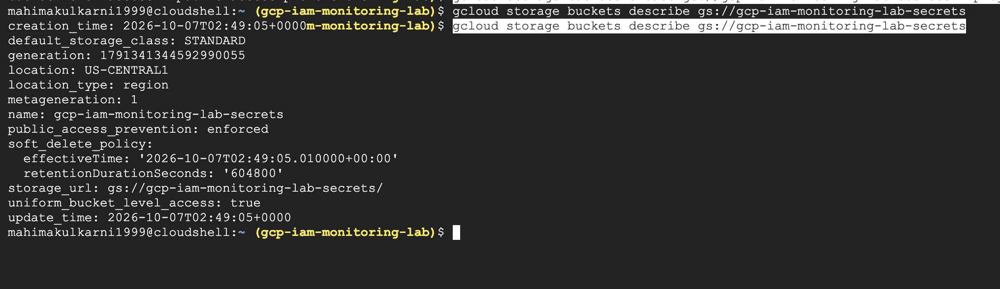

### Bucket-scoped read permission

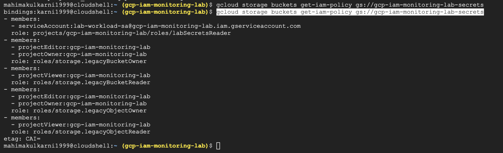

### Key-scoped decrypt permission

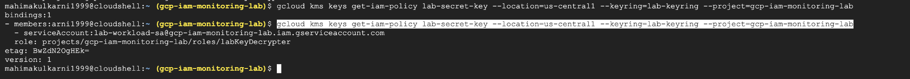

### VM identity from the metadata server

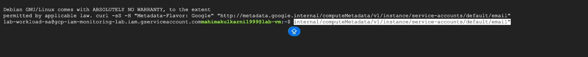

## Verified access tests

| VM operation | Result | Evidence filename |
| --- | --- | --- |
| Read encrypted object | Allowed | `24-vm-bucket-read-allowed.png` |
| Decrypt with lab key | Allowed | `25-vm-kms-decrypt-allowed.png` |
| List Compute Engine instances | Denied: `compute.instances.list` | `21-vm-list-permission-denied.png` |
| Upload an object | Denied: `storage.objects.create` | `26-vm-bucket-write-denied.png` |
| Encrypt with lab key | Denied: `cloudkms.cryptoKeyVersions.useToEncrypt` | `27-vm-kms-encrypt-denied.png` |

All five observed results matched the intended permissions: two allowed and three denied. This is a small functional test, not a comprehensive IAM security assessment. No second-key isolation test was performed.

The human administrator encrypted a dummy payload and uploaded only the ciphertext. The VM read and decrypted it. SSH login keys used to access Linux are separate from service-account JSON credential keys.

### Allowed operations

The attached workload account successfully read the encrypted object and decrypted the dummy payload.

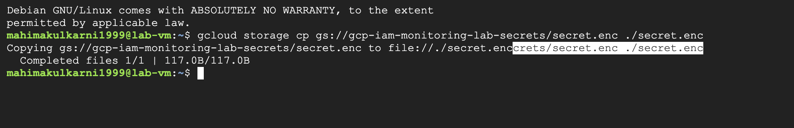

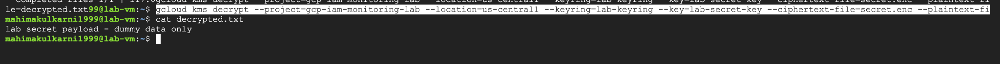

### Denied operations

The workload account could not list VMs, upload objects, or encrypt with the lab key.

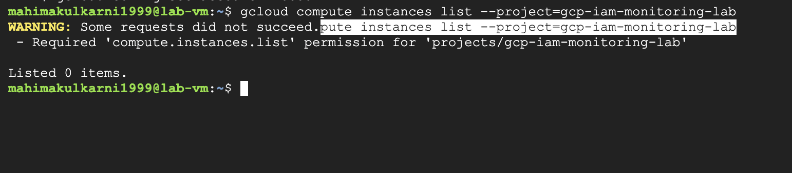

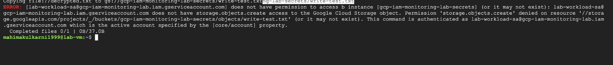

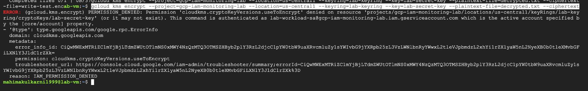

## Detection results

| SQL file | Purpose | Observed result |
| --- | --- | --- |
| [01-iam-policy-changes.sql](sql/01-iam-policy-changes.sql) | IAM policy changes | Dataset permission setup and controlled bucket permission change |
| [02-role-additions.sql](sql/02-role-additions.sql) | Extract `ADD`, member, role, resource, and actor from binding deltas | `lab-test-sa` received `roles/storage.objectViewer` on the bucket |
| [03-kms-decrypt-baseline.sql](sql/03-kms-decrypt-baseline.sql) | Review decrypt activity | Successful workload and human decrypts |
| [04-unexpected-kms-decrypt.sql](sql/04-unexpected-kms-decrypt.sql) | Exclude expected successful workload/key combination | Workload decrypt excluded; controlled human decrypt retained |
| [05-denied-kms-operations.sql](sql/05-denied-kms-operations.sql) | KMS permission denials | Workload `Encrypt` event with status code `7` |

The broad decrypt query returned two events. The tuned query returned one: it excluded one known-benign workload decrypt and retained one simulated unexpected-actor event. The exception requires the exact workload identity, exact key resource, and successful status. It does not exclude all service accounts or Google-managed service agents. An allowed identity can still be compromised; this exception alone does not detect misuse of its normal privileges.

The human decrypt was an authorized lab test, not an actual attack. The temporary test account's bucket binding was removed after detection validation.

### IAM policy changes detected

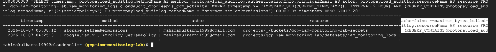

### Role addition extracted from the audit record

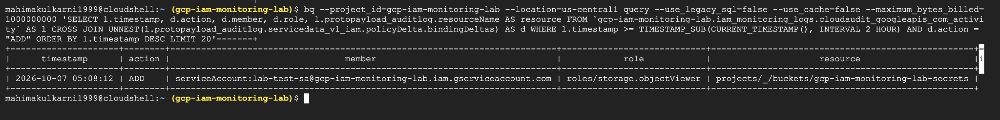

### Decrypt detection before tuning

Both the expected workload decrypt and the controlled human decrypt appeared in the broad query.

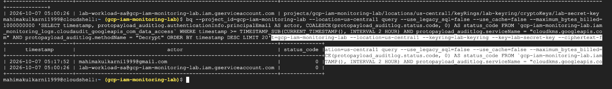

### Decrypt detection after tuning

The exact expected workload/key/success combination was excluded. The controlled human decrypt remained for review.

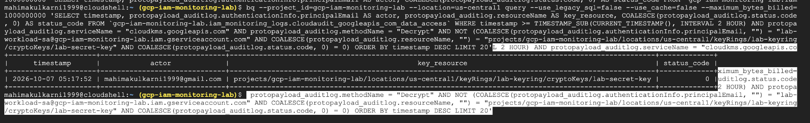

### Denied KMS encryption recorded in BigQuery

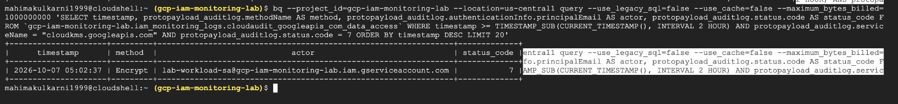

## Run the queries

The SQL uses a fixed UTC window covering the original lab events on October 7, 2026. This prevents the evidence from disappearing from results simply because a relative two-hour window has elapsed. Update the window, project, dataset, account, and key for a new lab.

From Cloud Shell, after downloading the repository:

```bash
bq --project_id=gcp-iam-monitoring-lab --location=us-central1 query --use_legacy_sql=false --use_cache=false --maximum_bytes_billed=1000000000 < sql/01-iam-policy-changes.sql
```

Repeat with the desired SQL filename. Queries require the dataset and exported logs to still exist. Local SQL remains available after cloud cleanup, but deleted BigQuery tables cannot be queried.

## Build notes and evidence

- [Build and test runbook](docs/BUILD.md)
- [Observed event timeline](docs/RESULTS.md)
- [Screenshot filenames and upload guidance](screenshots/README.md)
- [Cleanup status and procedure](docs/CLEANUP.md)

Screenshots 01–38 are stored in the [screenshots folder](screenshots/). Selected evidence is displayed above; the folder contains the complete collection. Review personal information before publishing additional evidence. No credentials are included in this repository.

## Lessons and limitations

Cloud Storage records this bucket IAM change as `storage.setIamPermissions`. A query matching only `SetIamPolicy` missed it; inspecting the actual audit record revealed the correct method. BigQuery exported the payload as `protopayload_auditlog`, with IAM deltas under `servicedata_v1_iam.policyDelta.bindingDeltas`. The SQL follows the observed schema.

Storage and KMS Data Access logging were explicitly enabled before the workload tests. The sink was configured before the generated test events. Results were checked with query caching disabled.

These are manually executed SQL detections, not scheduled alerts or real-time incident response. The lab collected cloud API audit events; it did not install an agent to collect VM operating-system activity logs. Logging and export may introduce delivery delay. Not every denied command was verified in BigQuery; the denied KMS encryption event was verified.

## Cleanup status

At the last verified checkpoint, the VM was stopped and the temporary test bucket binding was removed. Full cleanup is pending. Stopping a VM does not remove its disk, bucket, KMS key, or stored logs. Update this section after cleanup is verified.

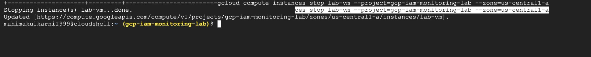
